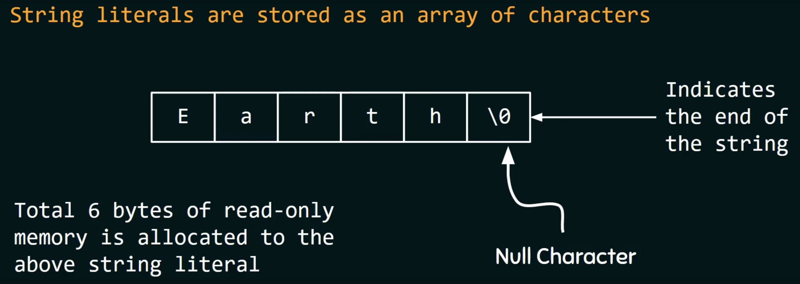
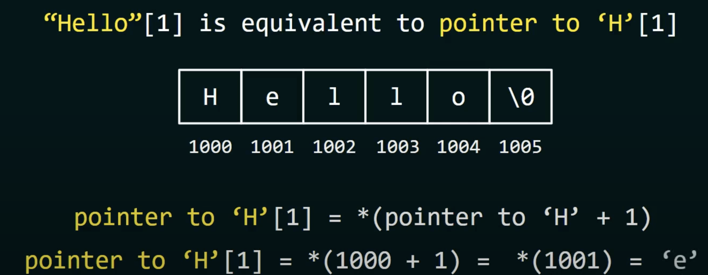

# STRING IN C
## 1. BASIC OF STRING LITERALS
### DEFINITION
- String literal (or string constant) is a sequence of characters enclosed within double quotes
- %s is a place holder
  ```C
  int main ()
  {
    printf ("%s", "Hello everyone");
    return 0;
  }
  ```
### STORING THE STRING LITERALS


- '\0' character must not be confused with '0' character.
- Compiler treats a string literal as a pointer to the first character.
- To the printf or scanf, we are passing a pointer to the first character of a string literal. Both printf and scanf function expect a character pointer (char* ) as an argument

### PERFORMING OPERATION ON STRING LITERALS
#### ASSIGNING STRING LITERALS TO A POINTER
```C
char* ptr = "Hello World!"
```
- ptr contains the address of the first character of the string literal.

- "HELLO"[0] => 'H'
- "HELLO"[1] => 'E'
- "HELLO"[2] => 'L'
- ...

- Noted that, string literal can not be modified:
```C
char* p =  "HELLO"
*p =  'M' /* not allowed */
```
- It is also known as string constant, it is allocated a read only memory. So we can not alter them.
- The same pointer can point to some other string literals.

## 2. STRING LITERAL VS CHARACTER CONSTANT
- They are not the same
- A string character is represented by a pointer to a character.
- A character constant is represented by an integer ASCII code)


