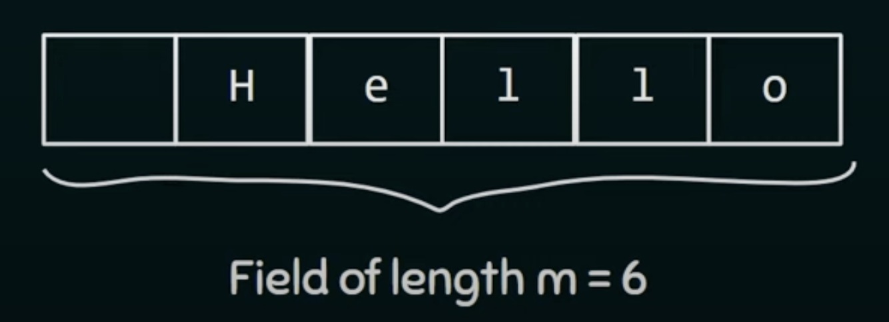
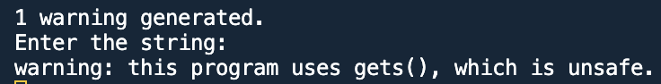

## 3. DECLARING A STRING VARIABLE
- A string variable is a one dimension array of character that holding a string at a time.
```C
char s[6];
```
- Do not forget to make an "extra room" for NULL
```C
char s[6] = "HELLO";
/* The length of one dimension of s is 6, while the string's length is 5. Because 1 room should be maintained for NULL */
```
- It seem like a string literal but it is not. When a string is assigned to a character array , then this character array is treated like other types of arrays. We can modified its characters.

```C
char s[6] = "HELLO";
char s[6] = { 'H', 'E', 'L', 'L', 'O' }
/* THEY ARE BOTH THE SAME */
```
- We can not modifined a string literal like this:
  ```C
  char* ptr = "HELLO";
  *ptr = 'M';
  ```
- We can modifined a char array like this:
  ```C
  char s[6] = "HELLO";
  s[0] = 'M';
  ```
### SHORT LENGTH INITIALIZER
```C
char s[7] = "HELLO";
```
- The extra rooms will remained empty (with 2 NULL)
### LONG LENGTH INITIALIZER
```C
char s[4] = "HELLO";
```
- If we try to print it, there will be a warning (unpredictable result)
### EQUAL LENGTH INITIALIZER
```C
char s[5] = "HELLO";
```
- You see that there is no room for NULL.
```C
#include <stdio.h>
int main()
{
    char s[5] = "HELLO";
    char t[5];
    int i;
    for (i = 0; s[i] != '\0'; i++)
    {
        t[i] = s[i];
    }
    printf ("%s", t);
    return 0;
}
/* HELLO�@LO�@ is the result */
```
- And if we change the code like this:
```C
#include <stdio.h>
int main()
{
    char s[6] = "HELLO";
    char t[6];
    int i;
    for (i = 0; s[i] != '\0'; i++)
    {
        t[i] = s[i];
    }
    t[i] = '\0';
    printf ("%s", t);
    return 0;
}
/* HELLO is the result */
```
### OMITTING LENGTH INITIALIZER
```C
char s[] = "HELLO";
```
- The compiler will automatically set aside 6 characters for s which is enough to store the string with an extra room for NULL.

## 4. WRITING STRING USING PRINTF AND PUTS FUNCTIONS
### USING PRINTF 
- To print just a part of a string, we use " %.ns " with n is the numbers of characters to be displayed on the screen.
- Addtionally, " %m.ns " with n is the numbers of characters to be displayed on the screen and m denotes the size of the field within which the string will be displayed.
```C
#include <stdio.h>
int main()
{
    char* ptr  = "HELLO WORLD";
    printf ("%.7s", ptr);
    printf ("\n");
    printf ("%6.5s", ptr);
    
    return 0;
}
/*
HELLO W
 HELLO
*/
```
   
- In the second printf, the value of m is 6, so there are 6 rooms in this field.
- All 5 characters will be displayed started from the right hand side (from "O" to "H".

### USING PUTS
```C
puts ();
```
- It is a function declared in <stdio.h> library and is used to write string to the output screen.
- It automatically writes a new line character after writing the string to the output screen.
```C
#include <stdio.h>
int main()
{
    char *s = "HELLO";
    puts(s);
    puts(s);
    return 0;
}
/*
HELLO
HELLO
*/
```
## 5. READING STRING USING SCANF AND GETS FUNCTIONS
### USING SCANF
- To read a string into a string variable (character array).
```C
#include <stdio.h>
int main()
{
    char a[10];
    printf ("Enter the string: \n");
    scanf ("%s", a); /* a is treated as a pointer to the first element of the array, so no need to put "&" */
    printf ("%s", a);
    return 0;
}
/*
Enter the string: 
this is a string
this
*/
```
- Only "this" is stored in this character array a.
- scanf() does not stored white space characters in the string varible.

### USING GETS
- To read entire line of input
```C
#include <stdio.h>
int main()
{
    char a[10];
    printf ("Enter the string: \n");
    gets(a);
    printf ("%s", a);
    return 0;
}
```
- Be careful, your program may crash, because the size of the character array is just 10 like this:


### NOTED THAT
- Both gets() and scanf() functions have no way to detec when the character array is full.
- It may cause undefined behaviour and probably lead to buffer overflow error which eventually cause the program to crash.
- Anyway, scanf() has the way to limit for the number of characters can be stored in the character array by using %ns.
```C
#include <stdio.h>
int main()
{
    char a[10];
    printf ("Enter the string: \n");
    scanf ("%9s", a);
    printf ("%s", a);
    return 0;
}
/*
Enter the string: 
hellomynameiskaka
hellomyna
*/
```


