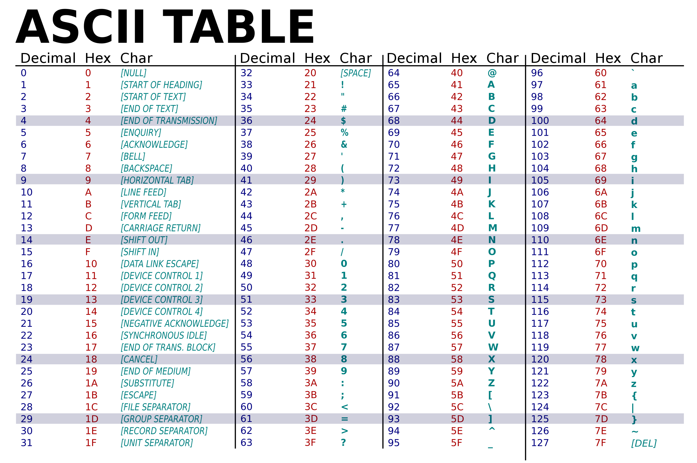

## 6.DESIGN THE INPUT FUNCTION USING GETCHAR()
### THE INPUT FUNCTION SHOULD HAVE FOLLOWING FUNCTIONALITIES
1. It must continue to read the string even after seeing a white space.
2. It must stop reading the string after seeing the newline character.
3. It must discared extra characters.
4. It must return the number of characters it stored in the character array.

### getchar()
- This function is used to read one character at a time from the input.
- It returns an integer equivalent to the ASCII code of the character.
- We can aslo use both "int" and "char" in place of char that is passing to getchar() function.

### ASCII CODE
ASCII, stands for American Standard Code for Information Interchange. It is a 7-bit character code where each individual bit represents a unique character.


### FUNCTION 
```C
//example: we print "Hello"
#include <stdio.h>

int input (char str[], int n)
{
    int ch, i=0;
    while ( (ch = getchar()) != '\n')
        if(i<n)
            str[i++] = ch;
    str[i] = '\0';
    return i;
}

int main()
{
    char str[100];
    printf ("Enter your string: ");
    int n = input (str, 5);
    printf ("%d %s", n, str);
    return 0;
}
/*
Enter your string: Hello
5 Hello
*/
