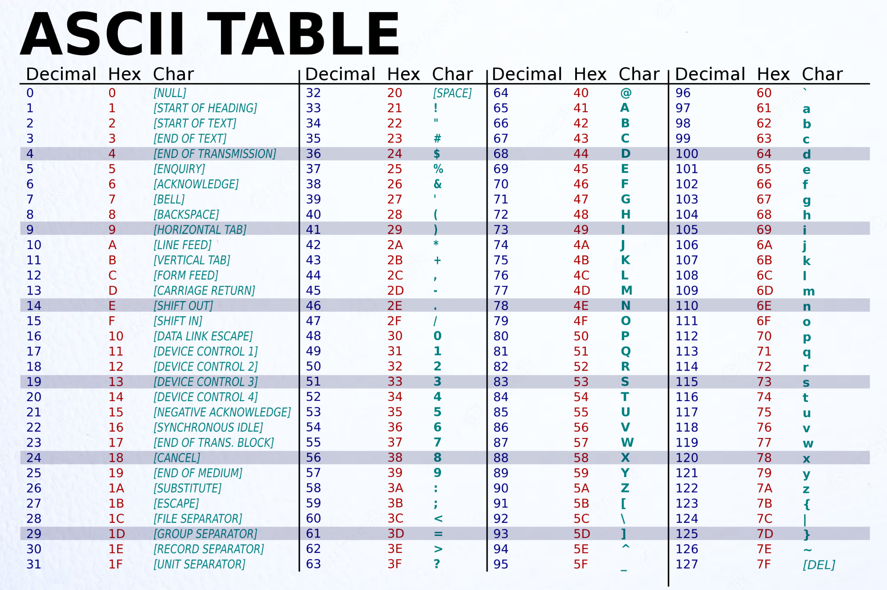

## 6.DESIGN THE INPUT FUNCTION USING GETCHAR()
### THE INPUT FUNCTION SHOULD HAVE FOLLOWING FUNCTIONALITIES
1. It must continue to read the string even after seeing a white space.
2. It must stop reading the string after seeing the newline character.
3. It must discared extra characters.
4. It must return the number of characters it stored in the character array.

### getchar()
- This function is used to read one character at a time from the input.
- It returns an integer equivalent to the ASCII code of the character.
- We can aslo use both "int" and "char" in place of char that is passing to getchar() function.

### ASCII CODE
ASCII, stands for American Standard Code for Information Interchange. It is a 7-bit character code where each individual bit represents a unique character.


### FUNCTION 
```C
//example: we print "Hello"
#include <stdio.h>

int input (char str[], int n)
{
    int ch, i=0;
    while ( (ch = getchar()) != '\n')
        if(i<n)
            str[i++] = ch;
    str[i] = '\0';
    return i;
}

int main()
{
    char str[100];
    printf ("Enter your string: ");
    int n = input (str, 5);
    printf ("%d %s", n, str);
    return 0;
}
/*
Enter your string: Hello
5 Hello
*/
```
### PUTCHAR FUNCTION IN C
```C
putchar();
```
- Prototype: int putchar (int ch)
- It accepts an integer argument and returns an integer representing the character writing on the screen.
- Remember that character is represented by binary form only, so there is no different if you write "int ch" instead of "char ch".
```C
#include <stdio.h>
int main()
{
    int ch;
    for (ch = 'A'; ch <= 'Z'; ch++)
        putchar(ch);

    return 0;
}
/*
ABCDEFGHIJKLMNOPQRSTUVWXYZ
*/
```

## 7. STRINGS
- If we have a printf function, we must be careful that:
1. If a character is enclosed within a single quote like this: '\n', it is treated like a character: printf("%c", '\n').
2. If a character is enclosed within a double quote like this: "\n", it is treated like a string: printf("%s", "\n").
- So, putchar() function expects a character, hence we will pass the character like this: putchar('\n').
- So, puts() function expects a string, hence we will pass the character like this: puts("\n").

### C STRING LIBRARY AND STRING COPY FUNCTION
```C
#include <string.h>
```
- It contains all the required function for performing string operations.
#### STRING COPY FUNCTION
- Prototype:  char* strcpy(char* destination, const char* source).
- strcpy is used to copy a string pointed by source (including NULL character) to the destination (character array).
- strcpy returns the pointer to the first character of the string which is copied in the destination. Hence, using %s then the whole string will be printed on the screen.
```C
#include <stdio.h>
#include <string.h>

int main()
{
    char s1[10] = "HELLO"; //source
    char s2[10]; //destination
    printf ("%s\n", strcpy(s2, s1));
    printf ("%s", s2);
    return 0;
}
/*
HELLO
HELLO
*/
```
```C
#include <stdio.h>
#include <string.h>

int main()
{
    char s1[10] = "HELLO";
    char s2[10];
    char s3[10];
    strcpy (s3, strcpy(s2,s1));
    printf ("%s %s", s2, s3);
    return 0;
}
/* HELLO HELLO */
```
- strcpy do not check the string pointed by s2 will fit s1 or not.
- If the length of s2 is greater than s1 the it will be undifined behavior.
- To avoid this, we can use "strncpy" function.

- Prototype: strncpy (destination, course, sizeof(destination))
```C
#include <stdio.h>
#include <string.h>

int main()
{
    char s1[10] = "HELLO";
    char s2[4];
    strncpy (s2, s1, sizeof(s2));
    printf ("%s", s2);
    return 0;
}
/* HELL */
```

